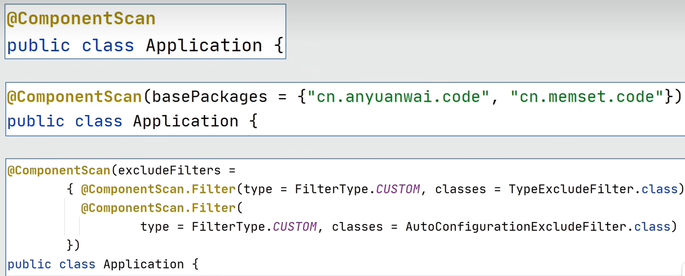
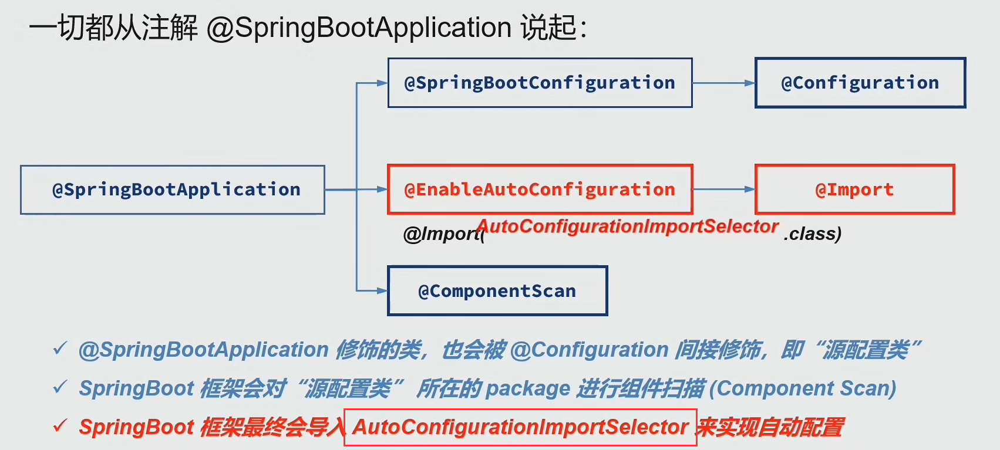
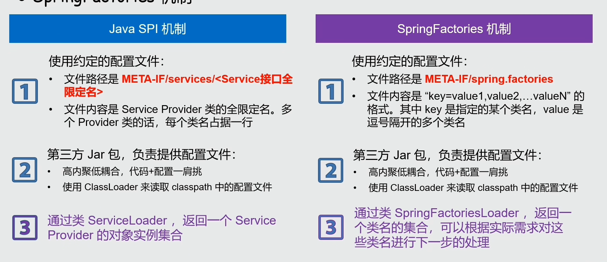
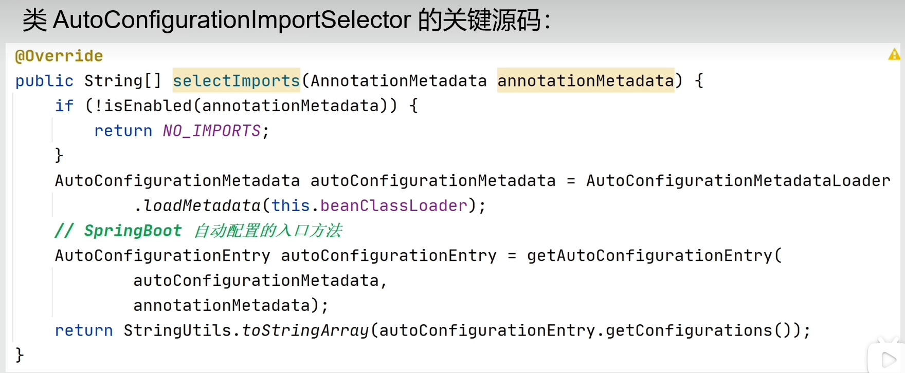
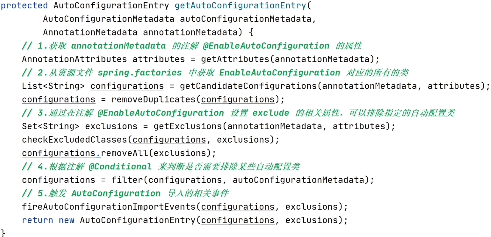
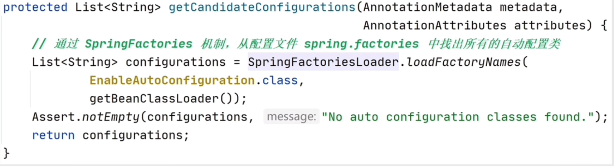
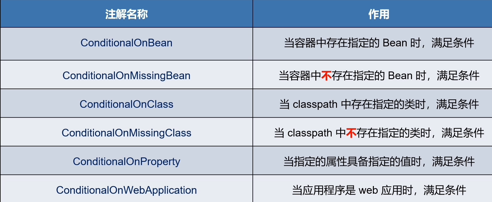

## 自动配置是什么
    Auto-Configuration
    1.基于引入的依赖jar包，对SpringBoot进行自动配置
    2.为框架的 “开箱即用” 提供了基础支撑

配置类 <br/>
    广义的配置类： 被注解 @Component 直接或间接修饰，就是常说的Spring 组件
    狭义的配置类： 被注解@Configuration 修饰的类

```java
 // 配置类示例
import lombok.Data;
import org.springframework.context.annotation.Bean;
import org.springframework.context.annotation.Configuration;
import org.springframework.stereotype.Component;

@Configuration
public class Constant {
    @Bean
    public String beanData() {
        return "bean";
    }
}

@Component
@ConfigurationProperties("xxx.config")
@Data
public class xxProperties {
    private String name;
}

```
## 自动配置原理简析
 从Springboot的启动流程开始分析
 - 1.创建一个ApplicationContext实例，即我们常说的IoC容器
 - 2.将主类（primaryClass）注册到IOC容器中 （重要）
 - 3.递归加载并处理所有的配置类 
 - 4.实例化所有的单例Bean
 - 5.如果是web应用，就启动web服务器

### 第三步：加载并处里所有的配置类
 简化代码描述关键流程
```java
public static void processConfigurationClasses(ApplicationContext context){
        //1.从Ioc容器中取出当前存在的原配置类
        Class<?> sourceConfigurationClass = getSourceConfgurationClass(context);
        //2.创建一个配置类解析器，然后递归加载并处理应用中所有的配置类
        ConfigClassParser parser = new ConfigClassParser(context);
        parser.parse(sourceConfigurationClass);
        //3.1向Ioc容器中注册@Bean方法对应的BeanDefinition
        loadBeanDefinitionsFromBeanMethods(parser.configurationClasses);
        //3.2 向Ioc容器中注册ImportBeanDefinitionRegister导入的BeanDefinition
        loadBeanDefinitionsFromRegisters(parser.configurationClasses);
        
}
```
解析的parse方法如下:


 - 处理ComponentScan
 - 处理Import对应的配置类
 - 最后处理Bean注解的实例
 - 还有BeanDefinition的优化
 - 最后综合所有的配置到一个全局配置类集合中

#### ComponentScan
对注解范围内或者指定的package进行扫描，找到符合要求的类
被注解@Component修饰的配置类
通过属性 basePackages 或者 basePackageClasses ，指定要进行的扫描package
如未指定，就默认扫描当前类所在的package

典型的使用示例：


#### Import
 提供一种显示地从其他地方加载配置类的方式，这样可以避免使用较差的组件扫描
 支持导入:
 - 普通类
 - 接口ImportSelector的实现类
 - 接口 ImportBeanDefinitionRegister的实现类

这三种支持的方式，其中ImportSelector最适合用来实现自动配置。

### 从主类注解出发


引入jar包，就可以自动扫描配置类，并加载Bean，配置yaml就可以实现的原因
是jar包本身设计使用了 类似 java SPI的机制，即SpringFactories机制



#### 自动配置关键：AutpConfigurationImportSelector

其中 getAutoConfigurationEntry


其中基于SpringFactories机制的加载方式：getCandidateConfigurations



💥💥Conditional扩展注解
